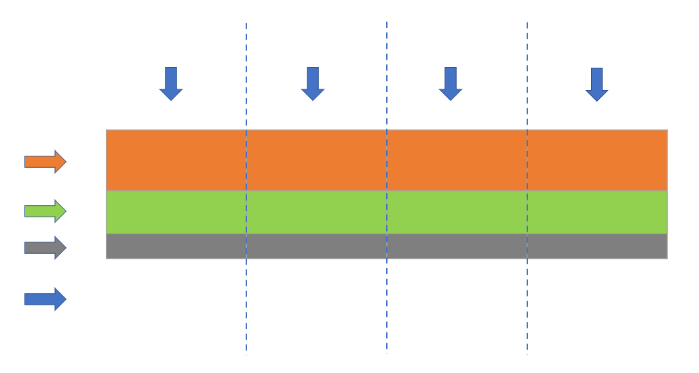

### 数据同步
#### 同步方式的选择
**1.直连同步**
之间调用规范的接口API可以实现数据的直连同步，配置简单，易于实现，但是业务量大时容易拖垮性能

**2.同步数据文件**
约定好文件编码、大小和格式能够直接同步数据文件，通过校验文件解决网络传输造成的丢包等问题，通过压缩解压缩和加解密提高文件传输的安全性

**3.数据库日志解析同步**
主流数据库都能够使用日志文件(MySQL中的binlog、HBase的Hlog和Oracle的归档日志)进行系统恢复
日志文件信息丰富且数据格式稳定，可以通过解析日志文件获取发生变更的数据，从而满足增量数据同步的需求。
使用数据库日志解析的同步方式有**实时**和**准实时**的同步能力，延迟在**毫秒**级别，对业务系统性能影响较小。

 * 阿里使用**DataX**完成多样数据源的海量数据同步
    DataX采用分布式全内存的方式进行批量同步，且无进程间通信
    通过解析MySQL的binlog日志来实时获得增量的数据更新
    通过消息订阅模式来实现数据的实时同步

### 问题与解决方案

##### 1.分库分表的处理
目前主流的数据库都支持**分布式分库分表**来实现**高并发**大数据量的处理，但是这也给数据同步带来了问题
通过建立中间状态的**逻辑表**来整合统一分库分表的访问
<!-- Taobao Distributed Data Layer -->

##### 2.高效同步和批量同步
**问题**
 * 传统方式同步海量数据会有很多重复性的操作，且工作量大
 * 数据源种类繁多，不同的数据源同步需要开发人员了解特殊配置
 * 其他业务的开发人员在大数据方面存在技术门槛

**解决方案**
 * 透明化数据同步配置，通过库名和表名唯一定位，获取元数据信息并自动生成配置
 * 简化数据同步步骤，并进行封装，达到批量化、易操作的效果，减少重复操作和技能门槛
<!-- OneClick -->

##### 3.增量和全量同步的合并
每次只同步变更的增量数据，然后与上次合并得到的全量数据进行合并从而获得最新的全量数据
传统的数据整合方案中，合并技术大多采用merge方式(update+insert)
当前流行的大数据平台基本都不支持update操作
使用全外连接(full outer join) + 数据全量覆盖重新加载(insert overwrite)
比如当天的增量数据和前一天的全量数据做全外连接，重新加载最新的全量数据。
*大数据量规模下，全量更新的性能高于update*

##### 4.同步性能的优化
数据同步任务的线程总数达不到用户设置的首轮同步的线程数，或不同数据同步任务的重要程度不同
根据需要同步的总线程数将待同步的数据拆分成相等数量的数据块，一个线程处理一个数据块，并将该任务对应的所有线程提交至同步控制器。

<!-- TODO 图示 -->

##### 5.数据漂移问题的解决 *p46*
数据漂移是ODS数据的一个顽疾，通常是指ODS表的同一个业务日期数据中包含前一天或后一天凌晨附近的数据或者丢失当天的变更数据。
ODS层需要按照时间段进行分区存储，通常做法是按照某些时间戳字段进行切分，而时间戳字段问题的准确性容易导致数据漂移。
时间戳字段分为:
*modified_time*(数据库表更新记录时间戳)
*log_time*(数据库日志更新时间戳)
*proc_time*(具体业务发生时间戳)
*extract_time*(数据被抽取的时间戳)
实际工程中这些时间戳是不一致的。
**解决方案**
根据log_time冗余每天前后15分钟数据，使用modify_time过滤非当天数据，确保不会因为系统问题遗漏
根据log_time获取后一天前15分钟的数据，并按照主键更具log_time升序排列去重
最后将前两步结果做全外连接，通过限制业务时间proc_time获取所需数据

##### 6.去重指标
**精确去重**时一般数据需要保存下来，在处理过程中遇到内存问题时可以采用主动倾斜数据的方式对节点做负载均衡
**模糊去重**则可以使用相关去重算法
 * 对于统计精度要求不高，统计维度较多时可以使用**布隆过滤器**
 * 统计精度要求不高，统计维度非常粗的情况使用**基数估计**

##### 7.数据倾斜
ETL过程中容易遇到数据倾斜问题，可以通过对数据进行分桶处理的方式来解决数据倾斜
 * 去重指标分桶，对去重字段hash分桶，相同的值肯定会进入到同一个桶中，每个桶再分别计算，利用的是每个桶的计算资源
 * 非去重指标分桶，数据随机分发到每个桶中，最后把每个桶的值会中，这里利用的是各个桶的计算资源

##### 8.事务处理
系统稳定性差、网络抖动、服务器重启等问题都可能导致分布式实时计算丢失数据
所以在流计算中提供数据自动ack、失败重发以及事务信息机制来保证数据的**幂等性**
