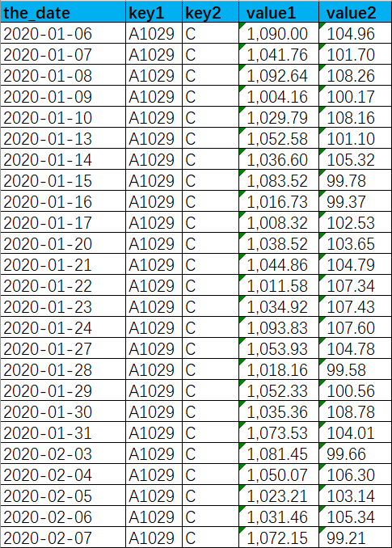
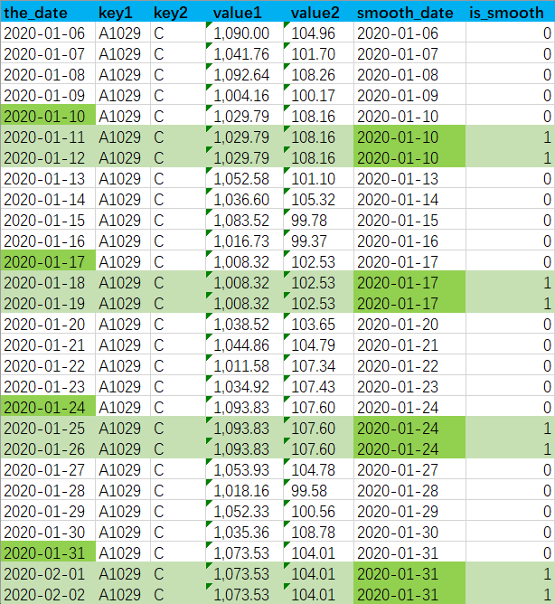
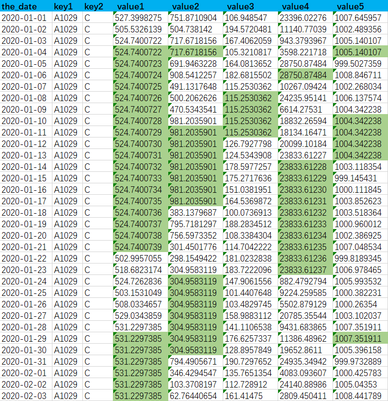
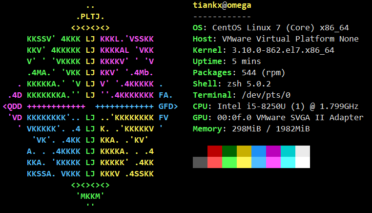

在分析金融行业的投资数据时，经常会使用到平滑这个操作，下面记录了集中情形的实现与优化

## 所谓平滑

数据的平滑具体表现有多种情形，简单列举一下几种：

1. 拉链表的数据一般没有连续的时间主键，只使用开始日期和结束日期来描述一个状态值(如评级)的生效日期范围，对拉链表做数据平滑就是把起期和止期展开成连续的时间，对应的状态和拉链表中所在时间区间一致
2. 金融行业的交易数据，只有交易日才会有数据，非交易日无数据，所以时间主键会存在不连续的情况，需要把数据平滑成每一天都有，若无某一天的数据，则使用这个日期之前最近的数据
3. 第三种区别于第二种情形，若一张表种的时间主键连续，即每一天都有数据，但是每条数据中有多个核心数值字段，且这些数值字段在某些日期为空，这些数值字段为空的规律不一致或没有规律，需要把数据平滑成核心数值字段都不为空的，若该字段为空，则取该日期之前最近的一个非空数据

以上几种情形，在做平滑时都会不可避免的用到笛卡尔积，下面是具体的案例，实现方式以及优化措施
 * 文末提供了生成虚拟数据的[python脚本](#虚拟数据生成脚本)
 * 更具体的代码见[Tiankx1003/TechSummary](https://github.com/Tiankx1003/TechSummary.git)
 * 若是有更优的实现方式，欢迎在评论区或[issues](https://github.com/Tiankx1003/tiankx1003.github.io/issues/8)交流

## 一、拉链表的展开

第一种情形比较简单，只需要使用拉链表和日历表做笛卡尔积就行
生成一张日历表

```sql
create table if not exists num (i int);-- 创建一个表用来储存0-9的数字
create table if not exists calendar(date_day date); -- 生成一个存储日期的表，datalist是字段名

insert into num (i) values (0), (1), (2), (3), (4), (5), (6), (7), (8), (9);-- 生成0-9的数字，方便以后计算时间

-- 这里是生成并插入日期数据
insert overwrite table calendar -- 2000年以来10000天日期数据
select
    date_add('2000-01-01', numlist.id) as `date`
from
    (
        select
            n1.i + n10.i * 10 + n100.i * 100 + n1000.i * 1000 as id
        from
            num n1
        cross join num as n10
        cross join num as n100
        cross join num as n1000
    ) as numlist;
```

然后做一张拉链表, 建表语句如下
```sql
create table rating_info_zip(
    key1        string comment '主键1',
    key2        string comment '主键2',
    start_date  string comment '起期',
    end_date    string comment '止期',
    rating      string comment '评级'
    ) comment '评级信息拉链表'
;
```

我们需要得到一张展开成连续日期的表，建表语句如下
```sql
create table rating_info_unzip(
    the_date    string comment '日期',
    key1        string comment '主键1',
    key2        string comment '主键2',
    rating      string comnent '评级'
    ) comment '评级信息表'
;
```

这种情况实现方式就很简单，只需要和日历表做笛卡尔积，然后取出对应时间区间的数据就好
```sql
insert overwrite table rating_info_unzip
select  t2.date_day              as the_date
        ,t1.key1
        ,t1.key2
        ,t1.rating
from rating_info_zip t1
cross join calendar t2
where t2.date_day between t1.start_date and t1.end_date
;
```

上面这种实现方式简单直接，但是性能较差，如果t1有m条数据，t2有n条数据，那么发散后就是m*n
后面我们再说优化思路

## 二、平滑生成非交易日数据
先做一张交易表，建表语句如下

```sql
create table trade_info(
    the_date    string '交易日期',
    key1        string '主键1',
    key2        string '主键2',
    value1      string '数值1',
    value2      string '数值2'
    ) comment '交易数据'
;
```

数据特征如下图，交易日有数据，非交易日无数据，平滑即复制出一条数据和最近的一条交易日数据一致



图中以某一组主键为例`key1='A1029' and key2='C'`，能看出只有工作日有数据，需要平滑成下图的效果



 * `smooth_date`用于表示平滑取自的日期，如周六和周日都是从周五平滑下来的，那他们的smooth_date都是周五的日期
 * `is_smooth`用于表示该条数据是否是平滑生成的，1为是，0为否，
 * 对于非平滑数据`is_smooth='1'`，smooth_date和the_date一致

最后平滑后的目标表建表语句如下
```sql
create table trade_info_smooth(
    the_date    string '交易日期',
    key1        string '主键1',
    key2        string '主键2',
    value1      string '数值1',
    value2      string '数值2',
    smooth_date string '平滑取自的日期',
    is_smooth   string '是否平滑, 1是'
    ) comment '交易数据-平滑后'
;
```

实现逻辑如下
```sql
-- 第一步先开窗取出每条数据对应的下一个有数据的日期
-- 这个日期减一就是需要平滑的截止日期
-- 为了方便使用我们落成一张临时表
create table tmp_trade_info as 
select   the_date       as start_date
        ,key1
        ,key2
        ,value1
        ,value2
        ,date_sub(
            lead(the_date, 1, to_date(current_timestamp))
                over(
                    partition by key1, key2
                    order by the_date
                    )
            ,1
            )           as end_date
from trade_info
;

-- 有了start_date和end_end_date，后面就和展开拉链表的方式一致了
insert overwrite table trade_info_smooth
select   t2.date_day        as the_date
        ,t1.key1
        ,t1.key2
        ,t1.value1
        ,t1.value2
        ,t1.the_date        as smooth_date
        ,case when t1.start_date = t1.end_date then '0'
              else '1' end  as is_smooth
from tmp_trade_info t1
cross join calendar t2
where t2.date_day between t1.start_date and t1.end_date
```

### 两种优化思路

笛卡尔积时左表的每条数据都要发散成n(右表的条数)倍，性能很差，我们可以采用下面两种方式优化

#### 1.是否跨年区分处理
对于start_date和end_date在同一年的数据我们没必要发散到整张表，只需要和所在年的365天发散即可
非交易日跨年的情况占少数，所以这种优化方式对效率提升了大约n/365倍
 * 不需要平滑的数据即`start_date = end_date`，可以直接取

以trade_info_smooth为例，实现方式如下
```sql
insert overwrite table trade_info_smooth
select  t.start_date        as the_date
        ,t.key1
        ,t.key2
        ,t.value1
        ,t.value2
        ,t.start_date       as smooth_date
        ,'0'                as is_smooth
from tmp_trade_info t
where start_date = end_date                     -- 不需要平滑
union all
select   t2.date_day        as the_date
        ,t1.key1
        ,t1.key2
        ,t1.value1
        ,t1.value2
        ,t1.start_date      as smooth_date
        ,'1'                as is_smooth
from (
    select t.*, year(start_day) y
    from tmp_trade_info 
    where start_date <> end_date                -- 需要平滑
        and year(start_day) = year(end_date)    -- 非跨年
    ) t1
join (select date_day, year(date_day) as y from calendar) t2
on t1.y = t2.y
where t2.date_day between t1.start_date and t1.end_date
union all
insert overwrite table trade_info_smooth
select   t2.date_day        as the_date
        ,t1.key1
        ,t1.key2
        ,t1.value1
        ,t1.value2
        ,t1.start_date      as smooth_date
        ,'1'                as is_smooth
from (
    select t.*
    from tmp_trade_info 
    where start_date <> end_date                -- 需要平滑
        and year(start_day) <> year(end_date)   -- 跨年
    ) t1
join calendar t2
where t2.date_day between t1.start_date and t1.end_date
```

 * 当然你也可以区别跨月处理，但是性能不如跨年

#### 2.打散左表，扩容右表

在做笛卡尔积时，同一个key会进到一个reducer种进行处理
如果存在数据倾斜，key值会有聚集
我们可以把左表的key打散，与扩容后的右表通过虚拟主键关联
既可以提升并发度，又可以解决数据倾斜问题
以trade_info_smooth为例，实现方式如下
```sql
set mapred.reduce.tasks=20;         -- 根据打散和扩容程度设置reducer个数
set hive.auto.convert.join=false;   -- 关闭mapjoin
insert overwrite table trade_info_smooth
select   t2.date_day        as the_date
        ,t1.key1
        ,t1.key2
        ,t1.value1
        ,t1.value2
        ,t1.the_date        as smooth_date
        ,case when t1.start_date = t1.end_date then '0'
              else '1' end  as is_smooth
from (
    select  t.*
            ,pmod(hash(concat(key1,key2)),20) as v_key -- 用于关联的虚拟主键
    from tmp_trade_info t
    ) t1
join (
    select c.date_day, v.v_key -- 用于关联的虚拟主键
    from calendar c
    lateral view explode(split('0,1,2,3,4,5,6,7,8,9,10,11,12,13,14,15,16,17,18,19',',')) v_key as v
    t2
on t1.v_key = t2.v_key
where t2.date_day between t1.start_date and t1.end_date
```

 * reduer个数，打散倍数，扩容倍数，三者一致

## 三、对于核心数值为空的填充
我们先造一张扩展的交易表， 建表语句如下

```sql
create table trade_info_ext(
    the_date    string '交易日期',
    key1        string '主键1',
    key2        string '主键2',
    value1      string '数值1',
    value2      string '数值2',
    value3      string '数值3',
    value4      string '数值4',
    value5      string '数值5'
    ) comment '交易数据'
;
```

数据特征如下下图，


图中以某一组主键为例`key1='A1029' and key2='C'`，有更多的数值字段，从图中能看出日期主键连续，但是每个数值字段都有为空的情况，需要给为空的的值填充一个该日期之前最近的一个非空值，最终效果如下图



表中这些数值字段为空的日期并不存在一致的规律，或者根本就没有规律
所以同一天的两个空值字段可能取自不同的日期
 * 暂且不关心每个空值转换取自的日期`smooth_date`和`is_smooth`

Oracle数据库支持`lag(col ignore nulls)`
```sql
insert overwrite table trade_info_ext_smooth
select   the_date
        ,key1
        ,key2
        ,nvl(
            value1,
            lag(value1 ignore nulls) -- hive不支持该写法
                over(
                    partition by key1, key2
                    order by the_date
                    )
            ) as value1
        -- value2, value3, value4, value5 ... 同理
from trade_info_ext
```

而hive并没有改语法的支持如果针对每个数值字段参考trade_info_smooth的方式处理，然后再通过主键关联在一起
代码如下
```sql
-- 很长，很蠢，
```
这种实现方式代码逻辑很臃肿，而且效率非常低，时间复杂度提升了n(需要平滑的value字段个数)倍

其实我们可以借助`collect_list`或者`collent_set`的自动去重特性来**间接实现**`ignore nulls`
实现方式如下
```sql
select  the_date
        ,key1
        ,key2
        ,ls_value1[0] as value1
        -- value2, value3, value4, value5 ... 同理
from (
    select   the_date
            ,key1
            ,key2
            ,collect_list(value1)
                over(
                    partition by key1, key2
                    order by the_date desc
                    rows between 1 preceding
                    )                       as ls_value1
            -- value2, value3, value4, value5 ... 同理
    from tab_demo
    ) t
```

## 写在最后

其实上面这些情形是在同一个需求中遇到的，
即trade_info_ext表同时存在非交易日无数据和有数据但数值字段为空的情形
需要先针对数值字段补充空值，然后在针对日期做平滑处理
最初的处理方式是在Sqoop接数据时就完成第一步的逻辑
因为是从上游Oracle数据库接入数据，所以可以使用`lag(col ignore nulls)`
接入数据后在关联日历表做日期平滑
但是数据量过大时容易**拖垮上游数据库性能**，使用Hive分布式处理更合适
所以才有了上述的优化
 * 区分跨年处理
 * 打散左表扩容右表增加并发度
 * hive实现`ignore nulls`

### 最终实现

#### 环境信息



 * CentOS 7.5
 * hadoop-3.1.3
 * hive-3.1.2 *execution-engine spark-2.4.5*
 * python-3.6.8
 * jdk1.8.0_144
 * scala-2.11.8


```sql
insert overwrite table tmp_trade_info_ext_smooth
select  the_date as start_date
        ,key1
        ,key2
        ,collect_list(value1)
            over(
                partition by key1, key2
                order by the_date desc
                rows between 1 preceding
                ) as value1
        ,collect_list(value2)
            over(
                partition by key1, key2
                order by the_date desc
                rows between 1 preceding
                ) as value2
        ,collect_list(value3)
            over(
                partition by key1, key2
                order by the_date desc
                rows between 1 preceding
                ) as value3
        ,collect_list(value4)
            over(
                partition by key1, key2
                order by the_date desc
                rows between 1 preceding
                ) as value4
        ,collect_list(value5)
            over(
                partition by key1, key2
                order by the_date desc
                rows between 1 preceding
                ) as value5
        ,lead(the_date, 1, to_date(current_timestamp))
            over(
                partition by key1, key2
                order by the_date
                ) as end_date
from trade_info_ext
;

set mapred.reduce.tasks=20;
set hive.auto.convert.join=false;
insert overwrite table trade_info_ext_smooth
select  t.start_date        as the_date
        ,t.key1
        ,t.key2
        ,t1.value1[0]       as value1
        ,t1.value2[0]       as value2
        ,t1.value3[0]       as value3
        ,t1.value4[0]       as value4
        ,t1.value5[0]       as value5
        ,t.start_date       as smooth_date
        ,'0'                as is_smooth
from tmp_trade_info_ext_smooth t
where start_date = end_date                     -- 不需要平滑
union all
select   t2.date_day        as the_date
        ,t1.key1
        ,t1.key2
        ,t1.value1[0]       as value1
        ,t1.value2[0]       as value2
        ,t1.value3[0]       as value3
        ,t1.value4[0]       as value4
        ,t1.value5[0]       as value5
        ,t1.start_date      as smooth_date
        ,'1'                as is_smooth
from (
    select t.*, year(start_day) y, pmod(hash(concat(key1, key2)), 10) v_key
    from tmp_trade_info_ext_smooth 
    where start_date <> end_date                -- 需要平滑
        and year(start_day) = year(end_date)    -- 非跨年
    ) t1
join (
    select   date_day
            ,year(date_day) as y 
            ,v.v_key
    from calendar
    lateral view explode(split('0,1,2,3,4,5,6,7,8,9,10,11,12,13,14,15,16,17,18,19',',')) v_key as v
    ) t2
on t1.y = t2.y and t1.v_key = t2.v_key
where t2.date_day between t1.start_date and t1.end_date
union all
insert overwrite table trade_info_smooth
select   t2.date_day        as the_date
        ,t1.key1
        ,t1.key2
        ,t1.value1[0]       as value1
        ,t1.value2[0]       as value2
        ,t1.value3[0]       as value3
        ,t1.value4[0]       as value4
        ,t1.value5[0]       as value5
        ,t1.start_date      as smooth_date
        ,'1'                as is_smooth
from (
    select t.*, pmod(hash(concat(key1, key2)), 10) v_key
    from tmp_trade_info_ext_smooth 
    where start_date <> end_date                -- 需要平滑
        and year(start_day) <> year(end_date)   -- 跨年
    ) t1
join (
    select   date_day
            ,v.v_key
    from calendar
    lateral view explode(split('0,1,2,3,4,5,6,7,8,9,10,11,12,13,14,15,16,17,18,19',',')) v_key as v
    ) t2
on t1.v_key = t2.v_key
where t2.date_day between t1.start_date and t1.end_date
;
```

### 虚拟数据生成脚本

```python
import datetime
import random

from chinese_calendar import is_workday

# python -m pip install -i https://pypi.tuna.tsinghua.edu.cn/simple chinesecalendar
file_name = './virtul_data.txt'
file_obj = open(file_name, 'w')
file_obj.truncate()
key1_list = [str]
for i in range(0, 60):
    key1_str = ('A' + ('%d' % i).zfill(4))
    key1_list.append(key1_str)
init_date = datetime.date(2004, 1, 1)
for i in range(0, 2500):
    delta = datetime.timedelta(days=i)
    new_date = init_date + delta
    if is_workday(new_date):  # 只能支持2004到2020年
        for j in range(1, 51):
            if random.randint(0, 6) % 6 != 1:
                key1 = key1_list[j]
                rand_num = random.randint(0, 5)

                if random.randint(0, 9) != 0:
                    value1 = str(round(random.uniform(999, 9999), 4))
                else:
                    value1 = 'null'
                if random.randint(0, 9) != 0:
                    value2 = str(round(random.uniform(99, 9999), 4))
                else:
                    value2 = 'null'
                if random.randint(0, 9) != 0:
                    value3 = str(round(random.uniform(9, 9999), 4))
                else:
                    value3 = 'null'
                if random.randint(0, 9) != 0:
                    value4 = str(round(random.uniform(999, 9999), 4))
                else:
                    value4 = 'null'
                if random.randint(0, 9) != 0:
                    value5 = str(round(random.uniform(0, 9999), 4))
                else:
                    value5 = 'null'

                if rand_num == 0:
                    line = new_date.strftime('%Y-%m-%d') + '\t' + str(key1) + '\t' + 'C' \
                           + '\t' + value1 + '\t' + value2 + '\t' + value3 + '\t' + value4 + '\t' + value5
                elif rand_num == 1:
                    line = new_date.strftime('%Y-%m-%d') + '\t' + str(key1) + '\t' + 'A' \
                           + '\t' + value1 + '\t' + value2 + '\t' + value3 + '\t' + value4 + '\t' + value5
                else:
                    line = new_date.strftime('%Y-%m-%d') + '\t' + str(key1) + '\t' + 'C' \
                           + '\t' + value1 + '\t' + value2 + '\t' + value3 + '\t' + value4 + '\t' + value5
                    line = line + '\n' + new_date.strftime('%Y-%m-%d') + '\t' + str(key1) + '\t' + 'A' \
                           + '\t' + value1 + '\t' + value2 + '\t' + value3 + '\t' + value4 + '\t' + value5
                print(line + '\n')
                file_obj.write(line + '\n')
            else:
                continue
    else:
        pass
```

#### 鸣谢
 * *感谢[书犁](https://github.com/chenshuli001)长久以来对我工作的帮助与支持*
