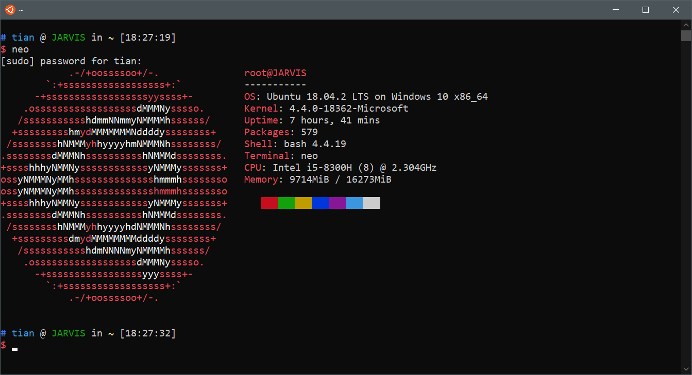

Windows Subsystem for Linux（简称WSL）是一个在Windows 10上能够运行原生Linux二进制可执行文件（ELF格式）的兼容层。


### 启用wsl
控制面板 -> 程序 -> 启用或关闭windows功能 -> 勾选试用linux的windows系统
或者在powershell中输入如下命令
```powershell
Enable-WindowsOptionalFeature -Online -FeatureName Microsoft-Windows-Subsystem-Linux
# vmware用户不要打开此项
Disable-WindowsOptionalFeature -Online -FeatureName VirtualMachinePlatform
```
重启生效

### 安装wsl版Ubuntu
应用商店 -> 搜索并下载Ubuntu
安装后第一次打开等待系统初始化
设置用户名密码后开始使用

### 更新到wsl2
```powershell
wsl --set-version <Distro> 2
wsl --set-default-version 2
```

### 后续配置

##### 更改apt为国内镜像源(以阿里云为例)
默认镜像源使用apt命令下载安装软件时网速会比较慢，我们改成国内的镜像源会快很多。
```bash
sudo vim /etc/apt/sources.list
```
```
deb http://mirrors.aliyun.com/ubuntu/ bionic main restricted universe multiverse
deb-src http://mirrors.aliyun.com/ubuntu/ bionic main restricted universe multiverse

deb http://mirrors.aliyun.com/ubuntu/ bionic-security main restricted universe multiverse
deb-src http://mirrors.aliyun.com/ubuntu/ bionic-security main restricted universe multiverse

deb http://mirrors.aliyun.com/ubuntu/ bionic-updates main restricted universe multiverse
deb-src http://mirrors.aliyun.com/ubuntu/ bionic-updates main restricted universe multiverse

deb http://mirrors.aliyun.com/ubuntu/ bionic-proposed main restricted universe multiverse
deb-src http://mirrors.aliyun.com/ubuntu/ bionic-proposed main restricted universe multiverse

deb http://mirrors.aliyun.com/ubuntu/ bionic-backports main restricted universe multiverse
deb-src http://mirrors.aliyun.com/ubuntu/ bionic-backports main restricted universe multiverse
```


##### 使用注册表更改windows中shell的codepage和字体
windows终端的字体在默认codepage为gbk时可用的字体较少，改为utf-8或OEM美国可选字体更多，如Consolas
```powershell
chcp 437 # codepage改为utf-8
chcp 936 # codepage改为gbk
```
打开注册表定位到`\HKEY_CURRENT_USER\Console`
修改对应项中的CodePage(437或936对应的16进制数)
修改FaceName中的字体
