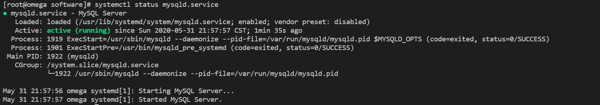

### 卸载CentOS7.5自带的MariaDB
> 基于CentOS6.8安装是我们要卸载系统自带的MySQL，而7.5系统需要卸载MariaDB

```bash
rpm -qa|grep mariadb
rpm -e --nodeps  mariadb-libs
```

### 下载MySQL5.7
```bash
wget http://dev.mysql.com/get/Downloads/MySQL-5.7/mysql-5.7.16-1.el7.x86_64.rpm-bundle.tar
# 压缩包不是uzip格式，使用-zxvf会有报错
tar -xvf mysql-5.7.16-1.el7.x86_64.rpm-bundle.tar -C ./
```

### 执行安装
```bash
# 以下语句按顺序执行
rpm -ivh mysql-community-common-5.7.16-1.el7.x86_64.rpm
rpm -ivh mysql-community-libs-5.7.16-1.el7.x86_64.rpm
rpm -ivh mysql-community-client-5.7.16-1.el7.x86_64.rpm
rpm -ivh mysql-community-server-5.7.16-1.el7.x86_64.rpm
```

### 查看版本
```bash
# 查看版本
mysqladmin --version
# 查看安装结果
rpm -qa|grep -i mysql
```


### 服务初始化
> 为了保证数据库目录为与文件的所有者为 MySQL 登录用户，如果你是以 root 身份运行 MySQL 服务，需要执行下面的命令初始化

```bash
mysqld --initialize --user=mysql
```
 * 报错：
> *--initialize specified but the data directory has files in it. Aborting.*


 * 原因：
初始化时已经有数据，找到mysql的文件删除并重新初始化

 * 解决：
```bash
whereis mysql
# /var/lib/mysql
mv /var/lib/mysql /var/lib/mysql_bak
```

### 启动服务
```bash
# 启动服务
systemctl start mysqld
```
 * 报错：
> *Job for mysqld.service failed because the control process exited with error code. See "systemctl status mysqld.service" and "journalctl -xe" for details.*

 * 原因：
```bash
# 查看状态
systemctl status mysqld.service
journalctl -xe
```

原因是系统默认是**强制模式**，会有权限问题，需要改为**宽容模式**

 * 解决：
```bash
# 
setenforce 0 
```

### 修改密码
> --initialize 选项默认以“安全”模式来初始化，则会为 root 用户生成一个密码并将该密码标记为过期，登录后你需要设置一个新的密码

```bash
# 查看缺省密码
cat /var/log/mysqld.log
# iOae_M#l7jmn
mysql -uroot -piOae_M#l7jmn
```
```sql
-- 修改密码
ALTER USER 'root'@'localhost' IDENTIFIED BY 'root';
```

### 服务自启
```bash
# 查看自启状态，默认enabled，即开机自启
systemctl is-enabled mysqld
# 查看启动状态
systemctl status mysqld

# 启动后查看进程
ps -ef|grep mysql
```

MySQL默认开机自启，使用以下命令关闭
```bash
# 如果是minimal的CentOS7.5需要先安装ntsysv
yum install -y ntsysv
ntsysv
```
方向键选择，空格变更状态，回车(ok/cancel)


